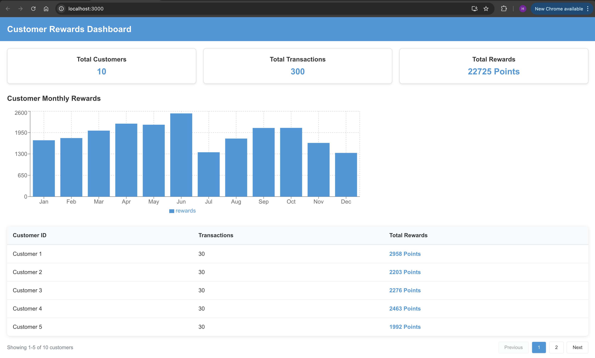
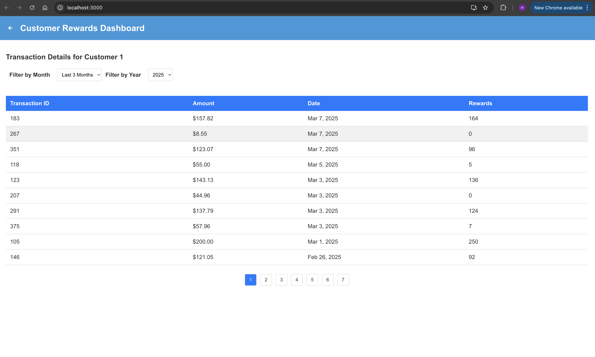
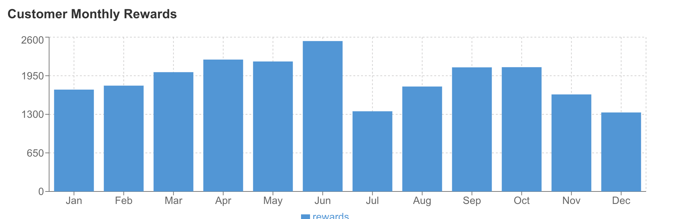
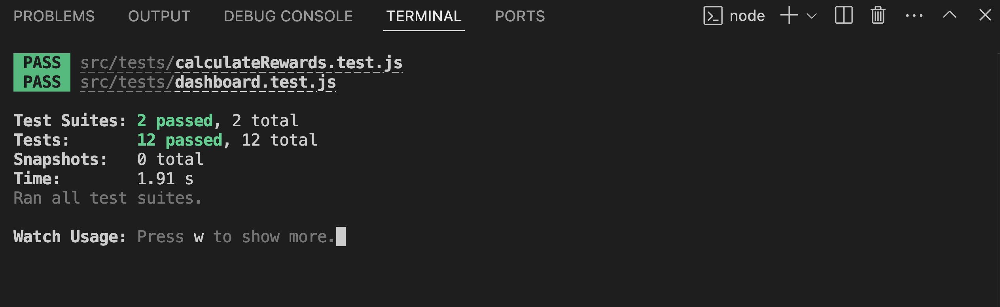

# Rewards App

A web application built using React.js that calculates and displays rewards points for transactions. It takes in a list of customer transactions, calculates reward points based on transaction data, and displays them in a table format. The app also supports displaying monthly rewards and total rewards for each customer.

## Table of Contents

- [Project Overview](#project-overview)
- [Technologies Used](#technologies-used)
- [Approach](#approach)
- [Key Components](#key-components)
- [Features](#features)
- [Installation](#installation)
- [Usage](#usage)
- [Screenshots](#screenshots)
- [Testing](#testing)

## Project Overview

The Rewards App is designed to help track customer transactions and calculate rewards points based on product purchases. The main features include:

- **Customer Rewards Summary**: Displays details of transactions, such as customer ID, customer name, total transaction amount, and total reward points.
- **Customer Summary**: Hides other customers and shows details for the selected customer, opening the Monthly Breakdown table.
- **Monthly Details Table**: Displays details of User Monthly Rewards, such as month, amount spent in that month, and reward points.
- **Transaction Details for Last Three Consecutive Months**: Shows the total rewards accumulated by the customer and the breakdown of the selected month.
- **Data Visualization**: Includes graphical representation of reward points and transaction data for better insights.
- **Dynamic Calculations**: The app dynamically calculates rewards points for customers as new transactions are added.
- **Filtering Capabilities**: Allows users to filter and sort data based on various parameters.

This project uses modern JavaScript features and React 18 for building the user interface, and integrates with ESLint and Prettier for code linting and formatting.

## Technologies Used

- React.js for building the user interface.
- Chart.js/React-chartjs-2 for data visualization and graphs.
- ESLint for linting JavaScript code to maintain code quality.
- Prettier for automatic code formatting.
- Babel for transpiling modern JavaScript and JSX syntax.
- PropTypes for type-checking React props.
- JavaScript (ES6+) for writing clean and modern JavaScript code.

## Approach

- **Data Structure**: Transaction data is organized by customer, and each customer has multiple monthly transactions. Reward points are associated with each transaction.
- **Calculating Total Rewards**: The total rewards for a customer are calculated by summing the reward points from each transaction.
- **Dashboard**: Centralized view providing an overview of all customer data and rewards metrics.
- **Rendering Data**: Data is displayed in multiple interface components:
  - The Transactions Table lists individual transactions.
  - The Customer Table shows customer information and aggregated rewards.
  - The Reward Details component provides detailed breakdowns of point calculations.
- **Data Visualization**: Interactive graphs display rewards points and transaction amounts, providing visual insights into customer spending patterns.
- **Filtering System**: Allows users to refine displayed data based on various criteria.

## Key Components

- `src/index.js`: Entry point of the React application.
- `src/App.js`: Main component where the structure of the app is defined.
- `components/dashboard.js`: Main dashboard component providing an overview of all customer rewards data.
- `components/customerTable.js`: Displays customer information and their aggregated rewards.
- `components/transactionTable.js`: Shows detailed transaction information for customers.
- `components/rewardDetails.js`: Provides detailed breakdown of reward point calculations.
- `components/filters.js`: Implements filtering capabilities for data refinement.
-
- `utils/calculateRewardPoints.js`: A utility function to calculate the total rewards points for a customer based on their monthly transactions.
-
- `calculateRewards.test.js`: Jest setup for running tests with React Testing Library.

## Features

- **Dashboard Overview**: Centralized dashboard presenting key metrics and data at a glance.
- **Customer Table**: Comprehensive view of all customers and their reward information.
- **Transaction Table**: Detailed view of individual transactions with relevant metrics.
- **Reward Details**: In-depth breakdown of how reward points are calculated for each transaction.
- **Filtering System**: Advanced filters to sort and refine data based on multiple parameters.
- **Data Visualization**: Interactive graphs show rewards points and transaction data trends over time.
- **Responsive Design**: The application is fully responsive and works across various device sizes.

## Installation

1. Clone the repository:

```
git clone https://github.com/haroonnisar111/customer-rewards-dashboard.git
cd customer-rewards-dashboard
```

2. Install dependencies:

```
npm install
```

3. Start the application:

```
npm start
```

This will start the development server, and the app will be available at http://localhost:3000.

## Usage

Once the app is running:

1. **Dashboard**: View the main dashboard for an overview of all customer rewards data.
2. **Customer Table**: Browse all customers and their total rewards information.
3. **Transaction Table**: Examine individual transactions with detailed information.
4. **Reward Details**: Review detailed breakdowns of how reward points are calculated.
5. **Filters**: Use the filtering system to refine displayed data based on various criteria.
6. **Data Visualization**: View graphical representations of transaction data and rewards points to identify trends and patterns.

## Screenshots

### Dashboard Overview



### Customer Table



### Data Visualization

The app includes graphical representations of rewards points and transaction data.


## Testing

This project includes unit tests for customerRewards and calculateRewards components using Jest and React Testing Library.


